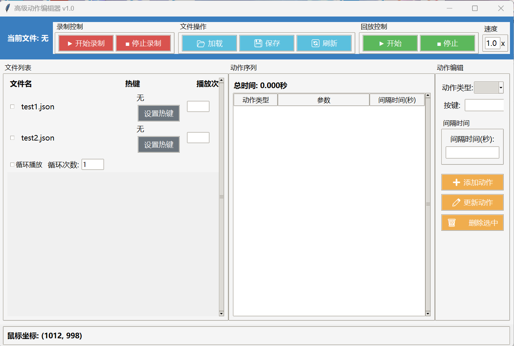

<h1>高级鼠标连点器 🖱️⚡</h1>

简体中文|<a href="README.md"</a>ENGLISH

一款功能强大的鼠标键盘自动化工具，支持录制和回放功能。

## ✨ 功能特性

- 🎥 **键鼠录制**: 记录鼠标移动、点击和键盘输入
- ▶️ **动作回放**: 可自定义设置回放录制的动作
- ✏️ **录制编辑**: 录制后可修改脚本
- 🔄 **组合回放**: 支持多个录制脚本顺序播放
- 🎚️ **热键控制**: 为动作分配并触发热键
- ♾️ **循环功能**: 无限循环或设置特定重复次数

## 🚀 快速开始

1. 从[发布页面](https://github.com/AMTOPA/Advanced-Mouse-Clicker/releases)下载最新版本
2. 双击 `高级鼠标连点器.exe` 启动程序
3. 开始录制新动作或加载已有脚本

## 🖥️ 界面概览

界面组成:

- **顶部面板**: 录制控制、文件操作和回放控制
- **左侧面板**: 可用的JSON脚本文件列表(双击编辑)
- **主区域**: 脚本编辑和配置选项

## 🎮 使用指南

### 基本操作

- 点击热键按钮为每个脚本分配热键
- 按下分配的热键开始回放
- 再次按下热键或ESC键停止回放

### 捆绑回放

1. 勾选要包含的脚本旁边的复选框
2. 设置每个脚本的重复次数(-1表示无限循环)
3. 点击右上角的"开始"按钮
4. 脚本将按照列表中的顺序依次播放

> 💡 **提示**: 当前回放顺序遵循文件列表顺序。您可以通过重命名文件(如01_脚本.json, 02_脚本.json)来控制顺序。

## 📜 许可证

本项目采用MIT许可证 - 详见[LICENSE](LICENSE)文件。

## 🤝 参与贡献

欢迎贡献代码！请提交issue或pull request。

---

⭐ 如果觉得这个项目有用，请在GitHub上给它点个star吧！

